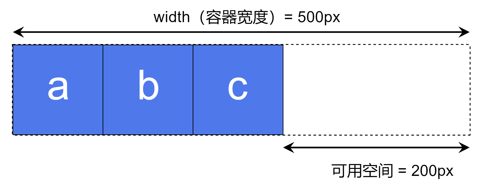

# 1. 概念

## 1. 轴线

+ 轴线分为**主轴**和**交叉轴**
+ `flex-direction`设置主轴: 默认为`row`,行向
+ 交叉轴是和主轴垂直的轴线,比如主轴设置为`column`,交叉轴就是水平方向

## 2. 起始线和终止线

+ 起始线和终止线和文档的书写模式相关,不能单纯的用上下左右来描述
如 `flex-direction: row;`时,在书写英文时,主轴的起始线是左边,终止线是右边;书写阿拉伯文时,主轴的起始线是右边,终止线是左边

## 3. 容器和元素(item项目)

+ 设置了 `display:flex`或`display:inline-flex`的元素会被称为**flex容器**;容器中的直系子元素就会变为 **flex元素**或者**item即项目**。
+ 如**flex元素**设置了`display:contents;`不会被视为flex元素,一些flex容器的属性不会再对其生效

## 4. 容器属性
1. flex-direction: 主轴方向
1. flex-wrap: 默认值为`nowrap`,不换行;可设置为`wrap`,将**flex容器**变为**多行flex容器**
2. flex-flow: <flex-direction> <flex-wrap>; 如`flex-flow: row wrap;` 表示主轴方向为`row`,换行

## 5. flex元素上的属性
+ [需要理解可用空间的特性](https://developer.mozilla.org/zh-CN/docs/Web/CSS/CSS_flexible_box_layout/Basic_concepts_of_flexbox#flex_%E5%85%83%E7%B4%A0%E4%B8%8A%E7%9A%84%E5%B1%9E%E6%80%A7)
  + 假设在 1 个 500px 的容器中，我们有 3 个 100px 宽的元素，那么这 3 个元素需要占 300px 的宽，剩下 200px 的可用空间。在默认情况下，flexbox 的行为会把这 200px 的空间留在最后一个元素的后面
  
  + 如果期望这些元素能自动地扩展去填充满剩下的空间，那么我们需要去控制可用空间在这几个元素间如何分配，这就是元素上的那些 flex 属性要做的事。
1. flex-grow
2. flex-shrink
3. flex-basis
4. flex: <flex-grow> <flex-shrink> <flex-basis>;flex是这三个属性按照的缩写,如 `flex:auto;` 相当于 `flex:1 1 auto`

## 6. 元素对齐和空间分配

### 1. **flex容器**上的属性
1. `align-items`: 控制所有**flex元素**在交叉轴方向的对齐方式
   + stretch: 初始值
   + flex-start
   + flex-end
   + start
   + end
   + center
   + baseline
   + first baseline
   + last baseline
  
2. `justify-content`: 控制所有**flex元素**在主轴方向的对齐方式
+ flex布局没有`justify-items`和`justify-self`属性
   + stretch（与 start 的行为相同）
   + normal（与 stretch（其行为与 start 的一致）的行为相同）
   + flex-start
   + flex-end
   + start
   + end
   + left
   + right
   + center
   + space-around: 项目之间间隔相等,首尾项目到边缘的距离是间隔的一半即使每个元素的**左右空间**相等
   + space-between: 项目之间间隔相等,首尾项目贴边
   + space-evenly:  所有间隔完全相等,包括首尾项目到边缘的距离

3. `align-content` : 如果有一个折行的多条**flex项目**的**flex容器**，可以使用`align-content`来控制每行之间空间的分配 
   + 控制多行 flex 元素在交叉轴上的对齐方式;只有当 flex 容器有多行元素时才生效(即 flex-wrap: wrap);调整整个内容区域在交叉轴上的**分布**
   + `align-content`类似于`justify-cotent`属性
   + 而`align-items`是控制flex容器内单行 flex 元素在交叉轴上的对齐方式,作用于单行 flex 元素

> 使用该属性的前提是**flex容器**的高度要大于**flex项目**的高度总和
   + flex-start
   + flex-end
   + start
   + fend
   + center
   + space-between
   + space-around
   + space-evenly
   + stretch
   + normal（与 stretch 的行为相同）
   + baseline
   + first baseline
   + last baseline
> [练习场](https://developer.mozilla.org/zh-CN/play)

### 2. `item`上的属性
1. `align-self`: 控制交叉轴上单个**flex项目**的对齐方式,值和`align-items`属性相同

## 7. 排序方式
+ flex-direction的值,如row和row-reverse

### 2.order属性
+ 例如，我有 5 个弹性条目，并按如下所示分配order值：

   Source item 1: order: 2
   Source item 2: order: 3
   Source item 3: order: 1
   Source item 4: order: 3
   Source item 5: order: 1
+ 这些项目将按以下顺序显示在页面上：
   Source item 3: order: 1
   Source item 5: order: 1
   Source item 1: order: 2
   Source item 2: order: 3
   Source item 4: order: 3

# 2. 额外属性值
1. `display:contents`:设置了`display:contents`的元素**本身不会被渲染**(也会导致该元素上其他元素的失效,因为不会被渲染),但是其**伪元素以及子元素会被正常渲染**

2. `gap`:<row-gap> <column-gap>; column-gap和row-gap属性的缩写;对flex布局和grid布局生效
   + column-gap:列元素之间的间隔大小(gutter)
   + row-gap:行元素之间的间隔大小(gutter)
   + **在grid布局中使用时,可以按照老版本的写法**: grid-gap;grid-column-gap;grid-row-gap
3. `visibility: collapse;`: 隐藏元素,但是区别于`display:none;`,`visibility: collapse;`虽然隐藏了元素但是依旧会占据空间
   + 适用于`table,flex,grid`等元素