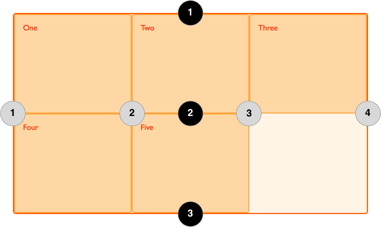

# 1.概念

## 1. 容器和项目
+ 在元素上声明`display：grid`或`display：inline-grid`来创建一个**网格容器**。一旦我们这样做，这个元素的所有**直系子元素**将成为**网格项目**。

### 1. 网格容器的两个简写属性
+ `grid-template`是下列三个属性的缩写
  + grid-template-rows
  + grid-template-columns
  + grid-template-areas

```CSS
.wrapper {
  display: grid;
  grid-template:
    "sd sd sd hd   hd   hd   hd   hd   hd" minmax(100px, auto)
    "sd sd sd main main main main main main" minmax(100px, auto)
    "sd sd sd ft   ft   ft   ft   .    ." minmax(100px, auto)
    / 1fr 1fr 1fr 1fr 1fr 1fr 1fr 1fr 1fr;
}
```
第一个值是 grid-template-areas 的值，并且在每一行的末尾声明了行的大小，也就是 minmax(100px, auto) 的作用。在 grid-template-areas 之后用一个左斜杠分隔，再之后是一个详细的列轨道清单。


+ `grid`
  + grid-template-rows
  + grid-template-columns
  + grid-template-areas
  + grid-auto-rows
  + grid-auto-columns
  + grid-auto-flow
+ 这个属性会把 grid-gap 属性的值重置为 0，而且你还不能在简写中设置间距值。
+ 可以像使用 grid-template 一样使用这个语法，不过要注意的是当它执行时，它会重置一些其他值。
```CSS
.wrapper {
  display: grid;
  grid:
    "hd hd hd hd   hd   hd   hd   hd   hd" minmax(100px, auto)
    "sd sd sd main main main main main main" minmax(100px, auto)
    "ft ft ft ft   ft   ft   ft   ft   ft" minmax(100px, auto)
    / 1fr 1fr 1fr 1fr 1fr 1fr 1fr 1fr 1fr;
}
```


## 2. 网格轨道(grid track)
+ 使用`grid-template-rows`和`grid-template-columns`属性定义网格上的行和列
+ 这些属性定义了网格轨道。网格轨道（grid track）是网格上任意两条相邻平行线之间的空间

### 1. grid-template-columns和grid-template-rows
+** 网格容器属性**

+ `grid-template-columns:200px 200px 200px`定义了三个绝对尺寸200px宽的列轨道

#### 1. fr单位(弹性尺寸)
+ fr 单位代表网格容器中可用空间的一部分

+ `grid-template-columns: 1fr 1fr 1fr`定义了三个占用grid容器宽度1/3的列轨道
+ `grid-template-columns: 2fr 1fr 1fr`可用空间被四等份,第一列占用2/4,第二列占用1/4,第三列占用1/4

#### 2. 弹性尺寸和绝对尺寸混合
+ `grid-template-columns: 500px 1fr 2fr;`第一条轨道是 500 像素，因此从可用空间中扣除了固定宽度。剩下的空间被一分为三，并按比例分配给两个灵活的轨道。

#### 3. `repeta()`标记
+ 如果包含多个重复列,可以使用`repeat()`标记来定义,如 `grid-template-columns:20px repeat(6,1fr) 3fr;`
+ `grid-template-columns:20px repeat(6,1fr,2fr) 30px;`,
  + `repeat(6,1fr,2fr)`创建了1fr的列轨道后面跟着2fr的列轨道然后重复6次; 和`repeat(1fr) repeat(6fr)`是不同的

### 2. 隐式和显式网格

+ grid-auot-rows和grid-auto-columns是容器属性

+ 什么是显式网格
 在创建示例网格时，我们使用 grid-template-columns 属性专门定义了列轨道，但网格也会自行创建行。这些行是隐式网格的一部分。而显式网格由使用 grid-template-columns 或 grid-template-rows 定义的任何行和列组成。
+ 什么是隐式网格
  如果你在定义的网格外放置内容，或者由于内容太多需要换到新的一行或者列，需要更多的网格轨道，那么网格就会在隐式网格中创建行和列。默认情况下，这些轨道会自动调整大小，因此它们的大小取决于轨道内的内容。
+ 设置隐式网格的宽度和高度
  可以使用 grid-auto-rows 和 grid-auto-columns 属性为在隐式网格中创建的轨道定义设定大小。

+ 在设置显式网格或定义自动创建的行或列的大小时，我们可能希望给轨迹一个最小尺寸，但也要确保它们能扩展以适应添加的任何内容
+ 例如，我可能希望我的行永远不会缩小到 100 像素以下，但如果我的内容高度扩展到 300 像素，那么我希望行也能扩展到这个高度。
+ 网格布局提供了 minmax() 函数来解决这个问题:`grid-auto-rows: minmax(100px, auto);`


## 3. 网格线(grid line)

### 1. 网格线的编号
+ 网格布局会为我们**创建编号**的网格线来让我们来定位每一个网格元素。

+ 网格线的编号顺序取决于文章的书写模式。在从左至右书写的语言中，编号为1的网格线位于最左边。在从右至左书写的语言中，编号为 1 的网格线位于最右边。网格线也可以被命名，我们将在稍后的教程中看到如何完成这一操作。



### 2. [跨轨道放置网格线](https://developer.mozilla.org/zh-CN/play)
+ grid-columns-start
+ grid-columns-end
+ grid-rows-start
+ grid-rows-end
+ **均为grid项目属性**

如
```html
<div class="wrapper">
  <div class="box1">一</div>
  <div class="box2">二</div>
  <div class="box3">三</div>
  <div class="box4">四</div>
  <div class="box5">五</div>
</div>
```
```CSS
.wrapper {
  display: grid;
  grid-template-columns: repeat(3, 1fr);
  grid-auto-rows: 100px;
}

.box1 {
  grid-column-start: 1;
  grid-column-end: 4;
  grid-row-start: 1;
  grid-row-end: 3;
}

.box2 {
  grid-column-start: 1;
  grid-row-start: 3;
  grid-row-end: 5;
}
```

### 3. 网格线定位简写


+ grid-column: <grid-column-start> / <grid-column-end>;
+ grid-row: <grid-row-start> / <grid-row-end>;
+ **均为grid项目属性**


```CSS
.box1 {
  grid-column: 1 / 4;
  grid-row: 1 / 3;
}
.box2 {
  grid-column1;
  grid-row: 3 / 5;
}
```
### 4. 再简写为grid-area

+ **均为grid项目属性**
+ grid-area: <grid-row-start> / <grid-column-start> / <grid-row-end> / <grid-column-end>;

+ 如`grid-area: 1 / 1 / 3 / 4;`

### 5. 使用span关键字
+ 除了”起始线与结束线“的定位方法，你还可以使用”起始线与跨越轨道数量“的定位方法
如 `grid-row: 1 / span 3;`


## 4. 网格单元(grid cell)
+ 网格单元（grid cell）是网格项中最小的单位，从概念上来讲其实它和表格的一个单元格很像。
+ 一旦一个网格元素被定义为父级元素，那么它的子级元素将会排列在每个事先定义好的网格单元中

## 5. 网格区域(grid area)
+ 项目可以按行或列跨越一个或多个单元格，这样就形成了一个网格区域（grid area）。网格区域必须是矩形的（例如不能创建 L 形区域）。

### 1. 使用grid-area命名

+ `grid-template-areas`是容器属性 
+ 使用`grid-template-areas`来使用`grid-area`定义好的名称
+ `grid-template-areas`的特殊值: `.`,用于占位但空白显式
+ 并且创建的area必须是一个矩形,参照sd,不能是L形状
+ `grid-template-areas`中的列和行尽量与`grid-template-columns/grid-auto-columns/grid-template-rows/grid-auto-rows`的轨道数量对应起来


```css
.header{
  grid-area:hd;
}
.footer{
  grid-area:ft;
}
.content {
  grid-area:ct;
}
.sidebar{
  grid-area:sd;
}
.wrapper {
  display: grid;
  grid-template-columns: repeat(9, 1fr);
  grid-auto-rows: minmax(100px, auto);
  grid-template-areas:
    "hd hd hd hd   hd   hd   hd   hd   hd"
    "sd sd sd main main main main main main"
    ".  .  . ft   ft   ft   ft   ft   ft";
}
```


## 6. 网格间距(grid gap)
+ `row-gap`
+ `column-gap`
+ **均为容器属性**

+网格单元格之间的横向间距（gutter）或纵向间距（alley）可以使用 column-gap 和 row-gap 属性或简写 gap 来创建。

## 7. 嵌套grid
+ 和flex元素一样,item可以在做为一个grid或者flex容器

### 1. subgrid
+ 通常情况下item中创建的嵌套grid网格线不会和父轨道的column对齐,但是可以使用subgrid这个特殊的属性值,让item中的子轨道和父轨道对齐
```CSS
.box1 {
  grid-column-start: 1;
  grid-column-end: 4;
  grid-row-start: 1;
  grid-row-end: 3;
  display: grid;
  grid-template-columns: subgrid;
}
```

## 8. 命名线布局

### 1. 网格线命名规则
+ 在用`grid-template-rows`和`grid-template-columns`属性定义网格时，可以为网格中的部分或全部网格线命名。

```CSS
.wrapper {
  display: grid;
  grid-template-columns: [main-start] 1fr [content-start] 1fr [content-end] 1fr [main-end];
  grid-template-rows: [main-start] 100px [content-start] 100px [content-end] 100px [main-end];
}
.box1 {
  grid-column-start: main-start;
  grid-row-start: main-start;
  grid-row-end: main-end;
}
.box2 {
  grid-column-start: content-end;
  grid-row-start: main-start;
  grid-row-end: content-end;
}
.box3 {
  grid-column-start: content-start;
  grid-row-start: main-start;
}
.box4 {
  grid-column-start: content-start;
  grid-column-end: main-end;
  grid-row-start: content-end;
}
```

### 2. 为一条网格线定义多个名字
  在上例中的`sidebar-end`和`main-start`其实是同一条线。为了实现这个效果，只要把多个名字都写到方括号里，然后用空格分隔就行了：`[sidebar-end main-start]`。在引用时可以使用其中的任何一个名字。

### 3. 网格线命名可隐式创建区域(grid-area)命名

+ 在选择名字时，如果把一个区域周围的线都用`-start`和`-end`作为后缀，就像上面的例子那样，网格就会为区域创建一个名字，名字就是后缀前的单词。再看上面的例子，我们把一些行和列命名为`content-start`和`content-end`，这意味着得到了一个命名为`content`的网格区域，并且可以在这个区域中放入你想放的内容。

```css
.wrapper {
  display: grid;
  grid-template-columns: [main-start] 1fr [content-start] 1fr [content-end] 1fr [main-end];
  grid-template-rows: [main-start] 100px [content-start] 100px [content-end] 100px [main-end];
}
.thing {
  grid-area: content;
}
```

```html
<div class="wrapper">
  <div class="thing">I am placed in an area named content.</div>
</div>
```
+ **这样做的好处就是不需要通过`grid-template-areas`来指定被命名区域的位置，因为它已经被命名线约束好了**。

### 4. 同3,网格区域命名时会隐式的创建网格线命名
在这个例子中额外增加了一个 div，它的样式类名为 overlay。我们先用 grid-area 属性创建命名的区域，然后用 grid-template-areas 创建布局。区域的名字是：
```CSS
.wrapper {
  grid-area:hd;
  grid-area:ft
  grid-area:main
  grid-area:sd
}
```
由此，即隐式地创建了行列网格线：

hd-start
hd-end
sd-start
sd-end
main-start
main-end
ft-start
ft-end